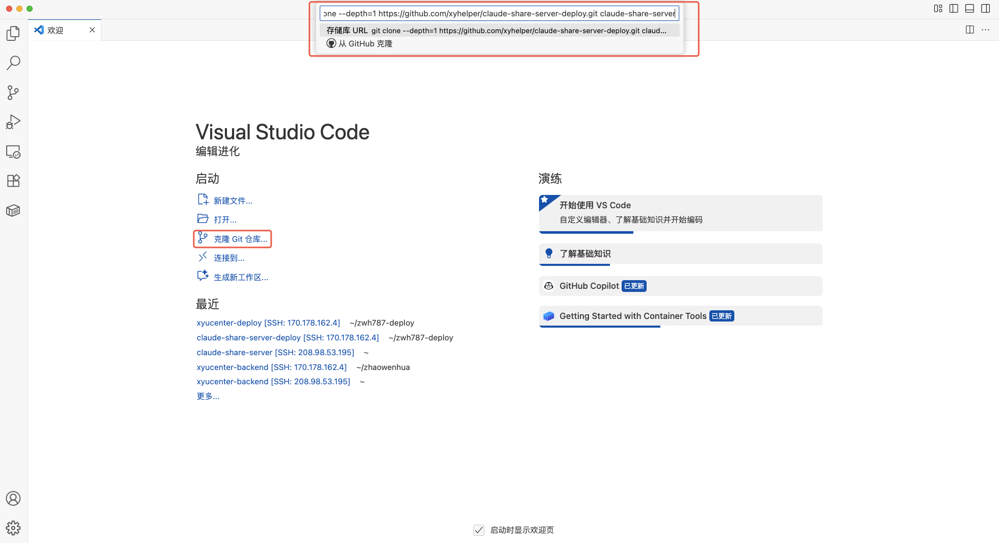
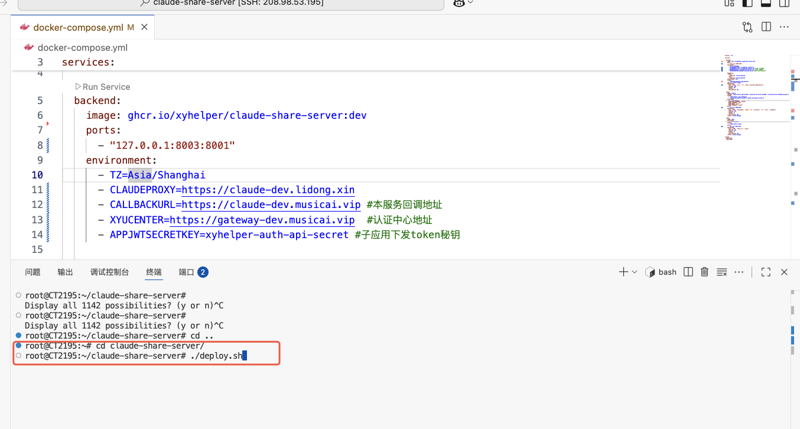
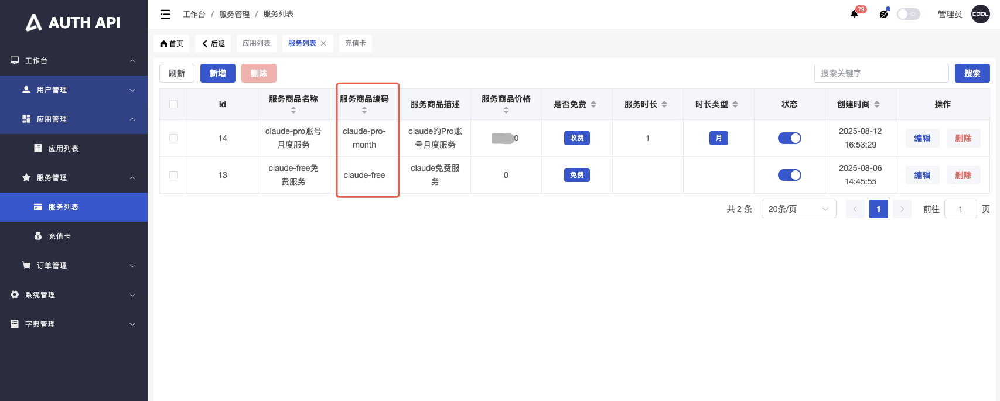

# claude-share-server-Deploy

claude-share-server 快速部署脚本库


## 前置条件
- 本项目为商业服务,依赖于`xyhelper.cn`提供的接入点服务运行
- 一台至少 2 核 2G 内存的服务器,推荐使用香港、新加坡、日本地区的服务器,可以兼顾国内访问。
- 安装了 docker 和 docker-compose
- 安装了 git


## 自动部署

在服务器上执行以下命令即可

```bash
curl -sSfL https://raw.githubusercontent.com/xyhelper/claude-share-server-deploy/master/quick-install.sh | bash

```

## 手动部署

1. 克隆本仓库到服务器上

```bash
git clone --depth=1 https://github.com/xyhelper/claude-share-server-deploy.git claude-share-server
```

2. 进入目录

```bash
cd claude-share-server
```

3. 启动服务

```bash
./deploy.sh
```

## 图文部署

部署claude-share-server项目需要先部署xyucenter项目按照下面步骤部署xyucenter项目

部署xyucenter项目步骤请查看 https://github.com/xyhelper/xyucenter-deploy

部署claude-share-server项目

1. 克隆claude-share-server-deploy仓库到服务器上，使用vscode连接上远程服务器，然后选择克隆项目，输入下面git clone命令
   git clone --depth=1 https://github.com/xyhelper/claude-share-server-deploy.git claude-share-server
   

2. 项目克隆之后，打开该项目，打开之后如下图所示，打开docker-compose.yml，修改环境变量
   

3. 找到backend服务下面的environment，配置一下环境变量  
   CLAUDEPROXY         服务转发地址  
   CALLBACKURL         claude-share-server的服务域名或地址  
   XYUCENTER           xyucenter服务地址（上文中部署xyucenter项目中的服务地址）  
   APPID               子应用在xyuecnter中注册的应用代码（xyucenter部署步骤中的11步配置的应用代码）
   APPJWTSECRETKEY     子应用jwt密钥（与上文中部署xyucenter项目中环境变量配置的JWT_SECRET_KEY保持一致）

4. 配置项目服务端口，mysql和redis的端口号
   
   
   

5. 修改config/config.yaml服务端口、mysql配置以及redis配置，与4保持一致，尤其是端口号配置

6. 命令终端，输入cd claude-share-server进入到项目中，再执行./deploy.sh，启动项目
   

7. 初始化数据库，使用工具连接上服务的数据库，执行docker-entrypoint-initdb.d/cool-20250815-091400.sql文件，初始化菜单

8. 使用claude-share-server服务前，需要先确认xyucenter中是否配置了相关服务，在xyucenter部署步骤中的11步配置
   claude的三种账号服务，约定服务code的前缀规则如下：  
   free账号服务  claude-free-后缀  
   pro服务账号   claude-pro-后缀  
   max服务账号   claude-max-后缀
   

9. 用户购买对应服务之后，方可使用对应服务的账号，免费服务无需购买

## 使用方法

选车页面访问地址为 http://服务器 ip:8001

管理后台地址为 http://服务器 ip:9000/xyhelper/

默认用户名密码为 admin/123456


